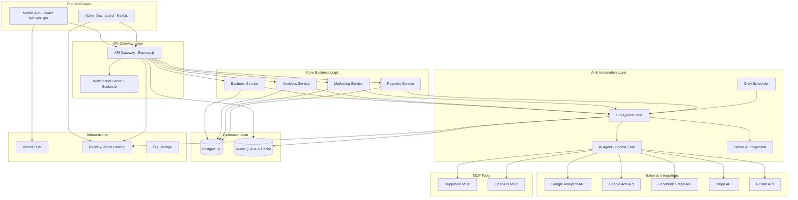

# Design Document

## Overview

Sophia AI Business Agent to autonomiczny system AI składający się z aplikacji mobilnej React Native (Expo) w stylu Soft UI oraz platformy backendowej opartej na czystym Node.js z automatyzacją job queue. System automatycznie tworzy, zarządza i skaluje biznesy oparte na modelu abonamentowym, wykorzystując zaawansowane narzędzia AI i integracje zewnętrzne.

### Kluczowe komponenty:
- **Mobile App (React Native/Expo)** - główny interfejs użytkownika z Soft UI design
- **Backend API (Node.js/Express)** - serwis zarządzający biznesami i logikę systemową  
- **AI Orchestration Layer (Bull Queue + Cron)** - automatyzacja job processing i scheduled tasks
- **Database (PostgreSQL + Redis)** - przechowywanie danych biznesów, kampanii, analytics i queue
- **MCP Tools Integration** - Puppeteer, OpenAPI dla monitoringu i testowania

## Architecture

### System Architecture Diagram



## Components and Interfaces

### 1. Mobile Application (React Native/Expo)

#### Technology Stack:
- **Framework**: React Native with Expo SDK 52+
- **Navigation**: Expo Router (file-based routing)
- **State Management**: Zustand + React Query
- **UI Framework**: Custom Soft UI components
- **Push Notifications**: Expo Notifications
- **Over-the-air Updates**: EAS Update

#### Soft UI Design System:
```typescript
// Design Tokens
export const SoftUITheme = {
  colors: {
    background: '#F8F9FA',
    surface: '#FFFFFF',
    primary: '#667EEA',
    success: '#48BB78',
    warning: '#ECC94B',
    error: '#F56565',
    text: {
      primary: '#2D3748',
      secondary: '#718096',
      disabled: '#A0AEC0'
    },
    shadow: {
      light: 'rgba(255, 255, 255, 0.8)',
      dark: 'rgba(174, 174, 192, 0.4)'
    }
  },
  spacing: {
    xs: 4, sm: 8, md: 16, lg: 24, xl: 32, xxl: 48
  },
  borderRadius: {
    sm: 8, md: 16, lg: 24, xl: 32
  },
  shadows: {
    neumorphic: {
      shadowColor: '#174c6b',
      shadowOffset: { width: 8, height: 8 },
      shadowOpacity: 0.2,
      shadowRadius: 16,
      elevation: 8
    }
  }
}
```

#### Key Screens Architecture:
```
src/
├── app/                    # Expo Router pages
│   ├── (tabs)/            # Tab navigation
│   │   ├── index.tsx      # Dashboard
│   │   ├── businesses.tsx # Business List
│   │   ├── analytics.tsx  # Analytics
│   │   └── profile.tsx    # User Profile
│   ├── business/          # Business Management
│   │   ├── [id]/          # Dynamic business routes
│   │   ├── create.tsx     # Create Business
│   │   └── ai-research.tsx# AI Research Mode
│   └── auth/              # Authentication
├── components/
│   ├── ui/                # Soft UI Components
│   ├── business/          # Business specific
│   ├── charts/            # Analytics Charts
│   └── forms/             # Form Components
├── hooks/                 # Custom React Hooks
├── services/              # API Services
├── stores/                # Zustand Stores
└── utils/                 # Utilities
```

### 2. Backend API (Node.js/Express)

#### Technology Stack:
- **Runtime**: Node.js 20+ 
- **Framework**: Express.js with TypeScript
- **Database ORM**: Prisma with PostgreSQL
- **Authentication**: JWT + NextAuth.js
- **Real-time**: Socket.io
- **Validation**: Zod
- **Task Queue**: Bull Queue with Redis

#### API Architecture:
```typescript
// Core API Structure
/api/
├── auth/              # Authentication endpoints
├── businesses/        # Business CRUD operations
├── campaigns/         # Marketing campaigns
├── analytics/         # Analytics data
├── payments/          # Stripe integration
├── ai/               # AI agent interactions
├── webhooks/         # External service webhooks
└── admin/            # Admin panel endpoints

// Main Services
interface BusinessService {
  createBusiness(data: BusinessCreationRequest): Promise<Business>
  generateBusinessIdea(): Promise<BusinessIdea>
  deployBusiness(id: string): Promise<DeploymentResult>
  monitorBusiness(id: string): Promise<BusinessStatus>
}

interface AnalyticsService {
  getBusinessMetrics(businessId: string): Promise<Metrics>
  generatePerformanceReport(businessId: string): Promise<Report>
  predictBusinessSuccess(businessId: string): Promise<Prediction>
}

interface MarketingService {
  createCampaign(businessId: string, config: CampaignConfig): Promise<Campaign>
  optimizeCampaign(campaignId: string): Promise<OptimizationResult>
  pauseCampaign(campaignId: string): Promise<void>
  scaleCampaign(campaignId: string, factor: number): Promise<void>
}
```

### 3. AI Orchestration Layer (Bull Queue + Cron + Sophia Core)

#### Job Queue Architecture (Bull + Redis):

**Core Job Types:**

1. **Business Creation Job**
```typescript
// Job Definition
interface BusinessCreationJob {
  businessId: string;
  enableAIResearch: boolean;
  businessData: BusinessData;
}

// Job Processing
export const processBusinessCreation = async (job: Job<BusinessCreationJob>) => {
  const { businessId, enableAIResearch, businessData } = job.data;
  
  // Step 1: AI Research (if enabled)
  if (enableAIResearch) {
    await aiService.conductMarketResearch(businessData.industry);
  }
  
  // Step 2: Generate Business Structure  
  const businessPlan = await aiService.generateBusinessPlan(businessData);
  
  // Step 3: Create Cursor Development Project
  await cursorService.createProject(businessPlan);
  
  // Step 4: Monitor Development Progress (Puppeteer MCP)
  const monitoringJob = await queue.add('monitor-development', { businessId });
  
  // Step 5: Setup remaining infrastructure
  await Promise.all([
    analyticsService.setupTracking(businessId),
    stripeService.createProduct(businessId),
    marketingService.createCampaigns(businessId)
  ]);
}
```

2. **Marketing Automation Job (Cron: Daily 9:00 AM)**
```typescript
export const processMarketingAutomation = async () => {
  const activeBusinesses = await businessService.getActiveBusinesses();
  
  for (const business of activeBusinesses) {
    // Fetch performance data
    const metrics = await analyticsService.getMetrics(business.id, '14d');
    const campaigns = await marketingService.getCampaigns(business.id);
    
    // AI Decision Making
    const decision = await sophiaAI.evaluateBusinessPerformance(business.id, metrics);
    
    if (decision.action === 'SCALE') {
      await marketingService.increaseBudget(campaigns, 0.2); // +20%
      await marketingService.createSimilarCampaigns(campaigns);
    } else if (decision.action === 'PAUSE') {
      await marketingService.pauseAllCampaigns(business.id);
      await businessService.markAsUnderReview(business.id);
    }
    
    // Generate report
    await reportService.generateDailyReport(business.id, decision);
  }
}
```

3. **Development Monitoring Job**
```typescript
export const processDevMonitoring = async (job: Job<{businessId: string}>) => {
  const { businessId } = job.data;
  
  // Initialize Puppeteer monitoring
  const puppeteerSession = await puppeteerMCP.createSession();
  
  try {
    // Monitor development progress
    const progress = await cursorService.getProjectProgress(businessId);
    
    // Run automated tests
    if (progress.hasTestableComponents) {
      const testResults = await puppeteerMCP.runAutomatedTests(progress.testUrl);
      await devService.updateTestResults(businessId, testResults);
    }
    
    // Check code quality
    const codeQuality = await cursorService.getCodeQualityMetrics(businessId);
    
    // Generate development report
    const report = await devService.generateProgressReport(businessId, {
      progress,
      testResults,
      codeQuality
    });
    
    // Notify on completion or issues
    if (progress.isComplete) {
      await notificationService.notifyDeploymentReady(businessId);
    } else if (report.hasIssues) {
      await notificationService.notifyDevelopmentIssues(businessId, report.issues);
    }
    
  } finally {
    await puppeteerSession.close();
  }
}
```

#### Sophia AI Core Agent:
```typescript
interface SophiaAIAgent {
  // Business Intelligence
  analyzeMarketOpportunity(industry: string): Promise<MarketAnalysis>
  generateBusinessPlan(idea: BusinessIdea): Promise<BusinessPlan>
  
  // Development Management  
  orchestrateDevelopment(businessPlan: BusinessPlan): Promise<DevelopmentPlan>
  monitorDevelopmentProgress(projectId: string): Promise<ProgressStatus>
  
  // Marketing Intelligence
  createMarketingStrategy(business: Business): Promise<MarketingStrategy>
  optimizeCampaignPerformance(campaign: Campaign): Promise<OptimizationPlan>
  
  // Decision Making
  evaluateBusinessPerformance(businessId: string): Promise<BusinessDecision>
  recommendActions(businessMetrics: Metrics): Promise<ActionPlan>
}
```

### 4. External Integrations Architecture

#### Google Analytics Integration (Direct API)
```typescript
import { google } from 'googleapis';

interface AnalyticsIntegration {
  setupTracking(businessId: string, websiteUrl: string): Promise<TrackingCode>
  getMetrics(propertyId: string, dateRange: DateRange): Promise<AnalyticsData>
  createCustomDashboard(businessId: string): Promise<DashboardConfig>
}

// Google Analytics Service Implementation
export class GoogleAnalyticsService implements AnalyticsIntegration {
  private analytics = google.analytics('v3');
  private analyticsData = google.analyticsdata('v1beta');
  
  async getMetrics(propertyId: string, dateRange: DateRange): Promise<AnalyticsData> {
    const response = await this.analyticsData.properties.runReport({
      property: `properties/${propertyId}`,
      requestBody: {
        dateRanges: [{ startDate: dateRange.start, endDate: dateRange.end }],
        metrics: [
          { name: 'activeUsers' },
          { name: 'conversions' },
          { name: 'totalRevenue' },
          { name: 'bounceRate' }
        ],
        dimensions: [{ name: 'date' }]
      }
    });
    
    return this.formatAnalyticsData(response.data);
  }
}
```

#### Google Ads Integration (Direct API)
```typescript
import { GoogleAdsApi } from 'google-ads-api';

interface GoogleAdsIntegration {
  createCampaign(business: Business): Promise<Campaign>
  updateBudget(campaignId: string, newBudget: number): Promise<void>
  pauseCampaign(campaignId: string): Promise<void>
  getCampaignMetrics(campaignId: string): Promise<CampaignMetrics>
}

// Google Ads Service Implementation
export class GoogleAdsService implements GoogleAdsIntegration {
  private client = new GoogleAdsApi({
    client_id: process.env.GOOGLE_ADS_CLIENT_ID,
    client_secret: process.env.GOOGLE_ADS_CLIENT_SECRET,
    developer_token: process.env.GOOGLE_ADS_DEVELOPER_TOKEN
  });
  
  async createCampaign(business: Business): Promise<Campaign> {
    const customer = this.client.Customer({
      customer_id: business.googleAdsCustomerId,
      refresh_token: business.googleAdsRefreshToken
    });
    
    const campaign = await customer.campaigns.create({
      name: `${business.name} - Subscription Campaign`,
      advertising_channel_type: 'SEARCH',
      status: 'ENABLED',
      campaign_budget: {
        amount_micros: business.initialBudget * 1000000,
        delivery_method: 'STANDARD'
      },
      bidding_strategy_type: 'TARGET_CPA',
      target_cpa: {
        target_cpa_micros: business.targetCPA * 1000000
      }
    });
    
    return this.formatCampaignData(campaign);
  }
  
  async updateBudget(campaignId: string, newBudget: number): Promise<void> {
    // Implementation for budget updates
  }
}
```

#### Stripe Integration (Direct API + Webhooks)
```typescript
import Stripe from 'stripe';

interface StripeIntegration {
  createSubscriptionProduct(business: Business): Promise<Stripe.Product>
  setupWebhooks(businessId: string): Promise<Stripe.WebhookEndpoint>
  handlePayment(paymentData: PaymentData): Promise<PaymentResult>
}

// Stripe Service Implementation
export class StripeService implements StripeIntegration {
  private stripe = new Stripe(process.env.STRIPE_SECRET_KEY);
  
  async createSubscriptionProduct(business: Business): Promise<Stripe.Product> {
    // Create product
    const product = await this.stripe.products.create({
      name: business.name,
      description: business.description,
      type: 'service'
    });
    
    // Create price
    const price = await this.stripe.prices.create({
      product: product.id,
      unit_amount: Math.round(business.monthlyPrice * 100),
      currency: business.currency.toLowerCase(),
      recurring: { interval: 'month' }
    });
    
    // Update business with Stripe IDs
    await businessService.updateStripeData(business.id, {
      productId: product.id,
      priceId: price.id
    });
    
    return product;
  }
  
  async setupWebhooks(businessId: string): Promise<Stripe.WebhookEndpoint> {
    return await this.stripe.webhookEndpoints.create({
      url: `${process.env.API_URL}/webhooks/stripe/${businessId}`,
      enabled_events: [
        'invoice.paid',
        'customer.subscription.created',
        'customer.subscription.updated',
        'customer.subscription.deleted',
        'payment_intent.succeeded',
        'payment_intent.payment_failed'
      ]
    });
  }
}

// Webhook Handler
export const handleStripeWebhook = async (req: Request, res: Response) => {
  const sig = req.headers['stripe-signature'];
  const endpointSecret = process.env.STRIPE_WEBHOOK_SECRET;
  
  try {
    const event = stripe.webhooks.constructEvent(req.body, sig, endpointSecret);
    
    switch (event.type) {
      case 'invoice.paid':
        await handleSuccessfulPayment(event.data.object);
        break;
      case 'customer.subscription.created':
        await handleNewSubscription(event.data.object);
        break;
      // Handle other events...
    }
    
    res.json({ received: true });
  } catch (err) {
    console.error('Webhook error:', err.message);
    res.status(400).send(`Webhook Error: ${err.message}`);
  }
};
```

### 5. MCP Tools Integration

#### Puppeteer MCP for Monitoring:
```typescript
interface PuppeteerMonitoring {
  // Website Health Monitoring
  checkWebsiteStatus(url: string): Promise<WebsiteStatus>
  performLighthouseAudit(url: string): Promise<LighthouseReport>
  
  // User Journey Testing
  testUserFlow(business: Business): Promise<UserFlowResult>
  validatePaymentProcess(businessId: string): Promise<PaymentTestResult>
  
  // Development Monitoring
  monitorCursorDevelopment(projectPath: string): Promise<DevelopmentStatus>
}

// Usage in Bull Queue Job
export const websiteHealthCheckJob = async (job: Job<{businessId: string}>) => {
  const { businessId } = job.data;
  const business = await businessService.getById(businessId);
  
  const healthCheck = await puppeteerMCP.checkWebsiteStatus(business.websiteUrl);
  const lighthouseReport = await puppeteerMCP.performLighthouseAudit(business.websiteUrl);
  
  await businessService.updateHealthMetrics(businessId, {
    ...healthCheck,
    lighthouse: lighthouseReport
  });
}
```

#### OpenAPI MCP for API Testing:
```typescript
interface OpenAPITesting {
  validateAPIEndpoints(businessId: string): Promise<APIValidationResult>
  testAPIContract(apiSpec: OpenAPISpec): Promise<ContractTestResult>
  monitorAPIPerformance(endpoints: string[]): Promise<PerformanceMetrics>
}
```

## Data Models

### Core Business Entities:

```typescript
// Database Schema (Prisma)
model Business {
  id          String   @id @default(cuid())
  name        String
  description String
  industry    String
  status      BusinessStatus
  createdAt   DateTime @default(now())
  updatedAt   DateTime @updatedAt
  
  // Business Configuration
  websiteUrl     String?
  repositoryUrl  String?
  landingPageUrl String?
  
  // Financial Data
  monthlyPrice   Decimal
  currency       String   @default("USD")
  
  // Analytics & Tracking
  analyticsId    String?
  stripeProductId String?
  
  // Relationships
  owner        User              @relation(fields: [ownerId], references: [id])
  ownerId      String
  campaigns    MarketingCampaign[]
  metrics      BusinessMetric[]
  deployments  Deployment[]
  
  @@map("businesses")
}

model MarketingCampaign {
  id          String   @id @default(cuid())
  name        String
  platform    CampaignPlatform
  status      CampaignStatus
  budget      Decimal
  spent       Decimal  @default(0)
  impressions Int      @default(0)
  clicks      Int      @default(0)
  conversions Int      @default(0)
  
  // External IDs
  googleAdsId  String?
  facebookId   String?
  
  // Dates
  startDate   DateTime
  endDate     DateTime?
  createdAt   DateTime @default(now())
  updatedAt   DateTime @updatedAt
  
  // Relationships
  business    Business @relation(fields: [businessId], references: [id])
  businessId  String
  
  @@map("marketing_campaigns")
}

model BusinessMetric {
  id          String   @id @default(cuid())
  date        DateTime
  visitors    Int      @default(0)
  conversions Int      @default(0)
  revenue     Decimal  @default(0)
  
  // Analytics Data
  bounceRate      Float?
  sessionDuration Float?
  pageViews       Int     @default(0)
  
  // Business Performance
  business    Business @relation(fields: [businessId], references: [id])
  businessId  String
  
  @@unique([businessId, date])
  @@map("business_metrics")
}

enum BusinessStatus {
  PLANNING
  DEVELOPING
  DEPLOYING
  ACTIVE
  PAUSED
  CLOSED
}

enum CampaignPlatform {
  GOOGLE_ADS
  FACEBOOK_ADS
  INSTAGRAM_ADS
  LINKEDIN_ADS
}

enum CampaignStatus {
  DRAFT
  ACTIVE
  PAUSED
  COMPLETED
  FAILED
}
```

## Error Handling

### Error Handling Strategy:

1. **API Level Error Handling**
```typescript
class SophiaError extends Error {
  constructor(
    message: string,
    public code: string,
    public statusCode: number = 500,
    public details?: any
  ) {
    super(message)
    this.name = 'SophiaError'
  }
}

// Error Types
export enum ErrorCodes {
  BUSINESS_CREATION_FAILED = 'BUSINESS_CREATION_FAILED',
  DEVELOPMENT_TIMEOUT = 'DEVELOPMENT_TIMEOUT',
  CAMPAIGN_OPTIMIZATION_FAILED = 'CAMPAIGN_OPTIMIZATION_FAILED',
  ANALYTICS_DATA_UNAVAILABLE = 'ANALYTICS_DATA_UNAVAILABLE',
  PAYMENT_PROCESSING_ERROR = 'PAYMENT_PROCESSING_ERROR'
}
```

2. **Bull Queue Error Handling**
```typescript
// Job Queue Error Handling
export const setupErrorHandling = (queue: Queue) => {
  queue.on('failed', async (job, error) => {
    console.error(`Job ${job.id} failed:`, error);
    
    // Log error details
    await errorService.logJobError(job.id, error);
    
    // Send notification to admin
    await notificationService.notifyAdminJobFailure(job.id, error);
    
    // Attempt retry with exponential backoff
    if (job.attemptsMade < 3) {
      const delay = Math.pow(2, job.attemptsMade) * 1000;
      await job.retry({ delay });
    } else {
      // Mark business as failed if critical job
      if (job.name === 'business-creation') {
        await businessService.markAsFailed(job.data.businessId);
      }
    }
  });
  
  queue.on('stalled', async (job) => {
    console.warn(`Job ${job.id} stalled, retrying...`);
    await job.retry();
  });
};
```

3. **Mobile App Error Handling**
```typescript
// React Query Error Handling
const useBusinessQuery = (businessId: string) => {
  return useQuery({
    queryKey: ['business', businessId],
    queryFn: () => api.getBusiness(businessId),
    retry: 3,
    retryDelay: (attemptIndex) => Math.min(1000 * 2 ** attemptIndex, 30000),
    onError: (error) => {
      // Log to analytics
      analytics.track('API_Error', { error: error.message })
      // Show user-friendly message
      toast.error('Wystąpił problem z pobieraniem danych biznesu')
    }
  })
}
```

## Testing Strategy

### 1. Unit Testing
```typescript
// Backend Unit Tests (Jest)
describe('BusinessService', () => {
  it('should create business with valid data', async () => {
    const businessData = {
      name: 'Test Business',
      description: 'Test Description',
      industry: 'SaaS',
      monthlyPrice: 29.99
    }
    
    const result = await businessService.createBusiness(businessData)
    expect(result).toMatchObject(businessData)
    expect(result.id).toBeDefined()
  })
})

// Frontend Unit Tests (Jest + React Native Testing Library)
describe('BusinessCard Component', () => {
  it('should render business information correctly', () => {
    const business = mockBusiness()
    const { getByText } = render(<BusinessCard business={business} />)
    
    expect(getByText(business.name)).toBeTruthy()
    expect(getByText(`$${business.monthlyPrice}/mo`)).toBeTruthy()
  })
})
```

### 2. Integration Testing  
```typescript
// API Integration Tests
describe('Business API Integration', () => {
  it('should create business and trigger n8n workflow', async () => {
    const businessData = mockBusinessData()
    
    // Create business
    const response = await request(app)
      .post('/api/businesses')
      .send(businessData)
      .expect(201)
    
    // Verify n8n workflow was triggered
    await waitFor(() => {
      expect(mockN8nWorkflow).toHaveBeenCalledWith(
        'business-creation',
        expect.objectContaining({ businessId: response.body.id })
      )
    })
  })
})
```

### 3. End-to-End Testing with MCP
```typescript
// E2E Tests using Puppeteer MCP
describe('Business Creation E2E', () => {
  it('should create business and deploy working website', async () => {
    // Create business through mobile app
    await puppeteer.navigate('app://business/create')
    await puppeteer.fill('#business-name', 'E2E Test Business')
    await puppeteer.fill('#description', 'Test business for E2E')
    await puppeteer.click('#create-button')
    
    // Wait for development to complete
    await puppeteer.waitForText('Deployment Complete', { timeout: 300000 })
    
    // Verify website is live
    const websiteUrl = await puppeteer.getText('#website-url')
    await puppeteer.navigate(websiteUrl)
    await puppeteer.waitForText('E2E Test Business')
    
    // Test payment flow
    await puppeteer.click('#subscribe-button')
    await puppeteer.fillStripePayment(mockCreditCard)
    await puppeteer.click('#pay-button')
    await puppeteer.waitForText('Payment Successful')
  })
})
```

### 4. Performance Testing
```typescript
// Load Testing with Artillery
config:
  target: 'https://sophia-api.example.com'
  phases:
    - duration: 60
      arrivalRate: 10
    - duration: 120
      arrivalRate: 20

scenarios:
  - name: "Create Business Flow"
    flow:
      - post:
          url: "/api/auth/login"
          json:
            email: "test@example.com"
            password: "password"
      - post:
          url: "/api/businesses"
          json:
            name: "Load Test Business {{ $randomString() }}"
            description: "Generated during load test"
            industry: "SaaS"
```

## Deployment Architecture

### Development Environment:
- **Mobile App**: Expo Development Build + EAS Update
- **Backend**: Local Node.js + PostgreSQL + Redis Docker
- **Job Queue**: Local Bull Queue with Redis
- **External APIs**: Sandbox/Test modes

### Production Environment:
- **Mobile App**: App Store + Google Play (EAS Build)
- **Backend**: Railway/Vercel hosting
- **Database**: Railway PostgreSQL + Redis
- **Job Queue**: Bull Queue on Railway
- **CDN**: Vercel for static assets
- **Monitoring**: Sentry + LogRocket

### CI/CD Pipeline:
```yaml
# .github/workflows/deploy.yml
name: Deploy Sophia AI

on:
  push:
    branches: [main]

jobs:
  test:
    runs-on: ubuntu-latest
    steps:
      - uses: actions/checkout@v3
      - uses: actions/setup-node@v3
      - run: npm ci
      - run: npm run test:backend
      - run: npm run test:frontend
      
  deploy-backend:
    needs: test
    runs-on: ubuntu-latest
    steps:
      - name: Deploy to Railway
        run: railway deploy
        
  deploy-mobile:
    needs: test
    runs-on: ubuntu-latest
    steps:
      - name: Build and Submit to App Stores
        run: |
          eas build --platform all --auto-submit
          eas update --branch production
```

### Monitoring & Observability:
```typescript
// Application Monitoring
const monitoring = {
  // Performance Metrics
  api_response_time: 'avg < 200ms',
  database_query_time: 'avg < 50ms',
  mobile_app_crashes: '< 0.1%',
  
  // Business Metrics  
  business_creation_success_rate: '> 95%',
  development_completion_rate: '> 90%',
  campaign_optimization_accuracy: '> 80%',
  
  // Infrastructure Metrics
  server_uptime: '> 99.9%',
  database_availability: '> 99.9%',
  job_queue_success_rate: '> 95%',
  bull_queue_processing_time: '< 5s average'
}
```

Ten design obejmuje wszystkie kluczowe aspekty systemu Sophia AI Business Agent, od architektury mobilnej aplikacji z Soft UI, przez integracje z zewnętrznymi serwisami, automatyzację workflow w Bull Queue, aż po monitorowanie za pomocą narzędzi MCP. System jest zaprojektowany jako skalowalna, autonomiczna platforma do automatycznego tworzenia i zarządzania biznesami w czystym Node.js/React Native stack.