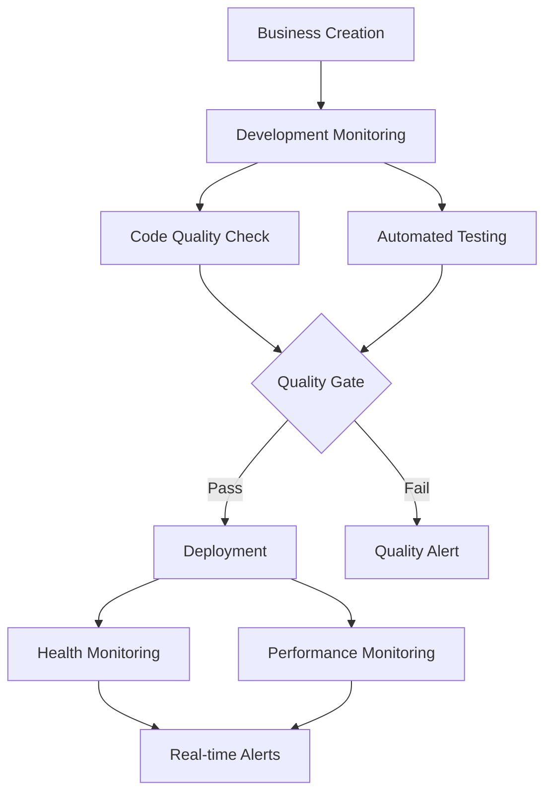

# Development Monitoring and Cursor AI Integration

## Przegląd

Zadanie 17 implementuje kompleksowe monitorowanie developmentu i integrację z Cursor AI dla automatycznego zarządzania projektami biznesowymi. System automatycznie śledzi postęp developmentu, sprawdza jakość kodu, uruchamia testy i monitoruje wdrożone aplikacje.

## Kluczowe Funkcjonalności

### 1. Rozszerzona Analiza Projektu
- **Automatyczna analiza postępu**: Sprawdza etapy developmentu (setup, development, testing, deployment, complete)
- **Sprawdzanie jakości kodu**: ESLint, TypeScript, security scanning
- **Analiza wydajności**: Złożoność kodu, duplikacja, optymalizacja
- **Pokrycie testowe**: Automatyczne wykrywanie i analiza testów

### 2. Automatyczne Testowanie
- **Testy jednostkowe**: Uruchamianie i raportowanie wyników testów jednostkowych
- **Testy E2E**: Automatyczne testy end-to-end z użyciem Puppeteer MCP
- **Testy integracyjne**: Framework dla testów integracyjnych
- **Comprehensive reporting**: Szczegółowe raporty z wszystkich typów testów

### 3. Monitorowanie Deploymentu
- **Health Checks**: Automatyczne sprawdzanie dostępności i statusu aplikacji
- **Performance Monitoring**: Analiza wydajności, Core Web Vitals, czas odpowiedzi
- **SSL/Security Checks**: Walidacja certyfikatów i bezpieczeństwa
- **Real-time Alerting**: Natychmiastowe powiadomienia o problemach

### 4. Integration z MCP Tools
- **Puppeteer MCP**: Rzeczywiste testy UI i monitorowanie
- **OpenAPI MCP**: Walidacja API i kontraktów
- **Automated Screenshots**: Dokumentacja wizualna i regresja
- **Performance Metrics**: Szczegółowe metryki wydajności

## Architektura

### Nowe Serwisy

#### CursorAIService - Rozszerzone Metody
```typescript
// Sprawdzanie jakości kodu
async getCodeQualityMetrics(businessId: string): Promise<CodeQualityMetrics>

// Automatyczne testowanie
async runAutomatedTests(businessId: string): Promise<TestResults>

// Setup monitoringu deployment
async setupDeploymentMonitoring(businessId: string, deploymentUrl: string): Promise<void>
```

#### Nowe Job Processors
```typescript
// Health check deployed applications
static async processDeploymentHealthCheck(job: Job<{businessId: string, deploymentUrl: string}>): Promise<JobResult>

// Monitor performance metrics
static async processPerformanceMonitoring(job: Job<{businessId: string, deploymentUrl: string}>): Promise<JobResult>
```

### Nowe Job Types
- `DEPLOYMENT_HEALTH_CHECK`: Cykliczne sprawdzanie health deployed apps
- `PERFORMANCE_MONITORING`: Monitoring wydajności aplikacji

### Enhanced Data Flow



## Konfiguracja

### Environment Variables
```env
# Cursor AI Integration
CURSOR_CLI_PATH=/usr/local/bin/cursor
CURSOR_PROJECTS_DIR=/var/projects

# MCP Tools
PUPPETEER_MCP_ENABLED=true
OPENAPI_MCP_ENABLED=true

# Monitoring Settings
HEALTH_CHECK_INTERVAL=300000  # 5 minutes
PERFORMANCE_CHECK_INTERVAL=900000  # 15 minutes
```

### Job Queue Configuration
```typescript
// Development monitoring - runs after business creation
await queue.add('development-monitoring', { businessId }, {
  priority: 'high',
  attempts: 3,
  backoff: { type: 'exponential', delay: 2000 }
})

// Health checks - recurring
await queue.add('deployment-health-check', { businessId, deploymentUrl }, {
  repeat: { every: 300000 }, // Every 5 minutes
  priority: 'normal'
})

// Performance monitoring - recurring
await queue.add('performance-monitoring', { businessId, deploymentUrl }, {
  repeat: { every: 900000 }, // Every 15 minutes
  priority: 'low'
})
```

## Quality Gates

### Code Quality Thresholds
- **ESLint errors**: < 10 (blocking deployment if > 50)
- **TypeScript errors**: 0 (blocking deployment if > 10)
- **Test coverage**: > 60% preferred
- **Security issues**: 0 high/critical vulnerabilities
- **Performance score**: > 70

### Automated Decisions
- **Auto-deploy**: Code quality good + all tests passing
- **Quality alerts**: ESLint > 50 errors OR TypeScript > 10 errors
- **Health alerts**: Site down OR response time > 5000ms
- **Performance alerts**: Performance score < 50

## Monitoring and Alerting

### Real-time Updates
```typescript
// Development progress updates
webSocketService.emitDevelopmentUpdate(businessId, {
  stage: 'testing',
  progress: 80,
  codeQuality: metrics,
  testResults: results
})

// Health status updates
webSocketService.emitNotification(ownerId, {
  type: 'error',
  title: 'Strona niedostępna!',
  message: `Strona jest niedostępna pod adresem ${url}`
})
```

### Performance Metrics
- **Load Time**: Czas ładowania strony
- **First Contentful Paint**: Czas do pierwszej zawartości
- **Largest Contentful Paint**: Czas do głównej zawartości  
- **Cumulative Layout Shift**: Stabilność layoutu
- **Core Web Vitals Score**: Ogólna ocena wydajności

## Testing

### Automated Test Pipeline
1. **Unit Tests**: Jest + coverage reporting
2. **Integration Tests**: API endpoints testing
3. **E2E Tests**: Puppeteer MCP user flows
4. **Performance Tests**: Lighthouse metrics
5. **Security Tests**: npm audit + custom scans

### Test Configuration
```typescript
// Jest configuration for unit tests
{
  testEnvironment: 'node',
  collectCoverage: true,
  coverageThreshold: {
    global: {
      branches: 80,
      functions: 80,
      lines: 80,
      statements: 80
    }
  }
}
```

## Troubleshooting

### Common Issues

#### 1. MCP Tools Not Available
```bash
# Check MCP server status
curl -X POST http://localhost:3000/mcp/health

# Restart MCP services
docker-compose restart mcp-puppeteer mcp-openapi
```

#### 2. High ESLint Errors
- Review `.eslintrc.js` configuration
- Run `npx eslint . --fix` for auto-fixable issues
- Check for project-specific linting rules

#### 3. E2E Tests Failing
- Verify application is running on expected port
- Check Puppeteer MCP connection
- Review screenshot captures for visual debugging

#### 4. Performance Issues
- Check for heavy dependencies
- Verify image optimization setup
- Review Next.js configuration

### Debugging Commands
```bash
# Check development monitoring logs
pm2 logs development-monitoring

# Manual code quality check
npm run lint
npm run type-check
npm audit

# Manual test run
npm test -- --coverage
npm run test:e2e

# Performance audit
npx lighthouse http://localhost:3000 --output=json
```

## Future Enhancements

### Planned Features
- **AI-powered code reviews**: Automated suggestions for improvements
- **Advanced security scanning**: SAST/DAST integration
- **Performance budgets**: Automated enforcement of performance thresholds
- **Multi-environment monitoring**: Staging/production comparison
- **Automated rollback**: Failed deployment auto-recovery

### Integration Opportunities
- **GitHub Actions**: CI/CD pipeline integration
- **Slack notifications**: Team collaboration alerts
- **DataDog/New Relic**: Advanced monitoring integration
- **SonarQube**: Professional code quality analysis

---

## Summary

Development Monitoring and Cursor AI Integration (Task 17) dodaje kompletny system automatycznego monitorowania i kontroli jakości do Sophia AI Business Agent. System automatycznie śledzi development, sprawdza jakość kodu, uruchamia testy i monitoruje deployed applications, zapewniając wysoką jakość i stabilność wszystkich utworzonych biznesów.